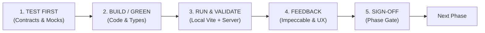
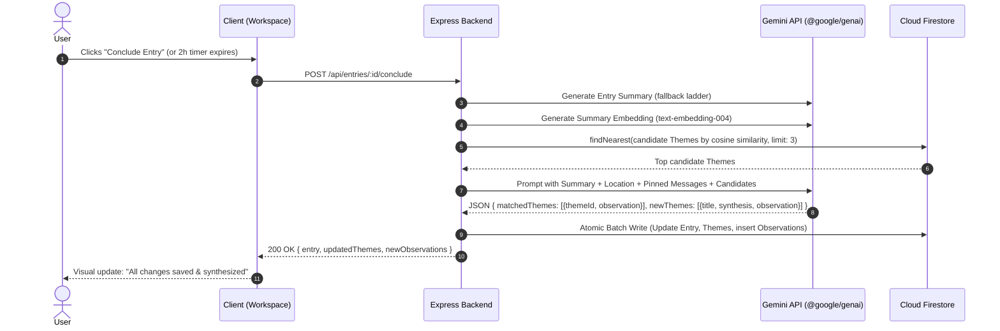

# Locus — Phased Implementation Plan & Engineering Playbook

*Design doc 3 of 3. Companions: `Locus — Core Object Model & Schema`, `Locus — Integrations, Demo Tooling & Build Plan`, `DESIGN.md`, `PRODUCT.md`.*

---

## 🔁 The Phase Execution Lifecycle: Contract-Driven & Mock-Boundary TDD

Every phase in this implementation plan operates under a non-negotiable **5-Step Test-Driven Development (TDD) Cycle**:



### The 3-Tier Locus TDD Pyramid

Because live LLMs are non-deterministic and external networks burn quota, testing adheres to 3 distinct strata:

1. **Tier 1: Fast Unit TDD (sub-100ms, Pure Functions)**:
   - Written *before* implementation code. Covers PII regex scrubbing, recursive `stripUndefined` hygiene, 2-hour inactivity delta math, prompt formatting templates, and LLM JSON output schema parsing.
2. **Tier 2: Service & Pipeline Mock-Boundary TDD (Mocks & Fallbacks)**:
   - Written alongside service wrappers. Simulates external failure modes: Gemini 429 rate limits, 503 service outages, model fallback ladder progression, malformed JSON recovery, and SSRF rejection of private IP ranges (`127.0.0.1`, `169.254.169.254`).
3. **Tier 3: Playwright E2E & Route TDD (Full-Stack Lifecycle & Visual Proof)**:
   - Written to validate user journeys and HTTP route contracts (`/api/entries/:id/conclude`, message pinning, auto-conclude timers), responsive viewport stability, and Impeccable visual rules (Source Serif 4 typography, Rule of One Accent `#3B7A57`).

### 5-Step Phase Sequence:
1. **`[TEST FIRST]`**: Author failing unit specs or Playwright route contracts (`tests/unit/`, `tests/e2e/`) specifying inputs, schema validations, and simulated error boundaries before writing service logic.
2. **`[BUILD / GREEN]`**: Write minimal types, services, integration clients, or React components to make tests pass cleanly, adhering strictly to [Locus Software Standards](file:///c:/Users/reyna/OneDrive/Documents/Locus/.agents/rules/software-standards.md) and [DESIGN.md](file:///c:/Users/reyna/OneDrive/Documents/Locus/DESIGN.md).
3. **`[RUN & VALIDATE]`**: Boot the unified server (`npm run dev`) and execute test runners (`npm run test:unit`, `npm run test:e2e`).
4. **`[FEEDBACK]`**: Run Impeccable design audits (`$impeccable audit / critique / polish`), capture visual screenshot proof, and prompt the user for interactive alignment.
5. **`[SIGN-OFF]`**: Confirm the phase's verification gate criteria (0 test failures, 0 lint errors, 0 design drift) before advancing.

---

## 📋 Phase 0: Architectural Triage, Re-evaluation & Verification Harness

### Objective
Re-evaluate the inherited Google AI Studio prototype, separate durable infrastructure from legacy clutter, align the repository to the [Locus Core Object Model](file:///c:/Users/reyna/OneDrive/Documents/Locus/docs/Locus-Core-Object-Model.md), and establish automated Playwright testing.

### Codebase Triage Matrix

| Component / File | Current Status | Action | Rationale |
|---|---|---|---|
| **Firebase Auth** (`src/lib/firebase.ts`) | Working Google popup auth | **KEEP** | Complies with federated authentication standard. Keep user session listener intact. |
| **Server Deserialization** (`server.ts`) | Top-level body parsers mounted first | **KEEP** | Complies with Software Standard 6.1 (ordering guarantee). |
| **Model Fallback Ladder** (`server.ts`) | `MODEL_FALLBACK_LADDER` helper exists | **KEEP & REFACTOR** | Move helper into reusable service module (`src/services/gemini.ts`). |
| **Undefined Stripping** (`src/lib/firebase.ts`) | Basic `stripUndefined` utility | **KEEP & EXPAND** | Ensure recursive stripping handles nested arrays and null objects safely. |
| **Data Types** (`src/types.ts`) | Uses legacy `Interaction` & `NotebookItem` | **REWORK** | Replace with locked schema: `Entry`, `Message`, `Theme`, `ThemeObservation`. Move `NotebookItem` to deferred status. |
| **Firestore Collections** (`src/lib/firebase.ts`) | `/users/{uid}/interactions` | **REWORK** | Migrate collection paths to `/users/{uid}/entries`, `/users/{uid}/themes`, `/users/{uid}/observations`. |
| **Firestore Rules** (`firestore.rules`) | Basic owner check on `interactions` | **REWORK** | Add owner-bound rules for `entries`, `themes`, `observations` guaranteeing strict user isolation. |
| **Sidebar & Pill Controls** (`src/components/`) | 11 permanent pills & dual taxonomies | **REBUILD** | Replace with Impeccable calm wireframes: collapsed toolbar, single taxonomy, serif user voice. |
| **Synthesis Pipeline** (`src/components/IntelligenceDrawer.tsx`) | Client-side ad-hoc prompt | **REBUILD** | Replace with backend synchronous synthesis pipeline (`embed ➔ findNearest ➔ Gemini resolution ➔ batch write`). |
| **Integrations** (PII, Webhooks, Maps) | Missing / stubs | **REBUILD** | Implement isolated wrappers in `src/integrations/<service>/` per third-party integration standards. |

### Technical Implementation Details
1. **Verification Tooling Setup**:
   - Install Playwright: `npm install -D @playwright/test`.
   - Scaffold `playwright.config.ts` targeting `http://localhost:3000` with headless Chromium.
   - Create test harness directory: `tests/e2e/`.
2. **Schema Restructuring** (`src/types.ts`):
   ```typescript
   export type EntryStatus = 'active' | 'concluded';
   
   export interface EntryLocation {
     name: string;            // e.g. "Balanga, Bataan", "Home Office", or "The Mill Coffee, SF"
     latitude?: number;       // Optional GPS lat
     longitude?: number;      // Optional GPS lng
     source: 'gps' | 'manual';
   }

   export interface Entry {
     id: string;
     userId: string;
     createdAt: string;
     concludedAt?: string;
     status: EntryStatus;
     summary?: string;
     locationContext?: EntryLocation | null;
     mood?: string;
     stance?: string;
     isDemo?: boolean;
   }

   export interface Message {
     id: string;
     entryId: string;
     userId: string;
     role: 'user' | 'ai';
     content: string;
     timestamp: string;
     isPinned?: boolean;
     note?: string;
   }

   export interface Theme {
     id: string;
     userId: string;
     title: string;
     currentSynthesis: string; // rolling 2-3 sentences
     observationCount: number;
     createdAt: string;
     updatedAt: string;
     embedding?: number[];
     isDemo?: boolean;
   }

   export interface ThemeObservation {
     id: string;
     userId: string;
     entryId: string;
     themeId: string;
     observationText: string;
     timestamp: string;
     locationSnapshot?: string; // e.g. "Home Office" at time of observation
     isDemo?: boolean;
   }
   ```
3. **Firestore Security Rules Realignment** (`firestore.rules`):
   - Enforce absolute user document isolation:
     `match /users/{userId}/{document=**} { allow read, write: if request.auth != null && request.auth.uid == userId; }`

### User Actions & External Services Required
- [ ] Confirm local `.env` contains `VITE_FIREBASE_API_KEY`, `VITE_FIREBASE_PROJECT_ID`, and `GEMINI_API_KEY`.

### Verification Gate (Phase 0)
- `npm run lint` (`tsc --noEmit`) passes cleanly with new schema.
- Playwright runner boots and passes a basic smoke test (`npx playwright test`).

---

## ⚡ Phase 1: Core Loop & Synchronous Synthesis Pipeline

### Objective
Build the immutable `Entry` lifecycle (`Start Entry` ➔ `Send Message` ➔ `Conclude Entry`), turn pinning/notes, the 2-hour inactivity auto-conclude timer, and the synchronous Gemini + Vector similarity synthesis pipeline.

### Technical Implementation Details



1. **2-Hour Auto-Conclude Engine**:
   - Client records `lastActivityTimestamp` in `localStorage`.
   - On tick (every 30s), if `Date.now() - lastActivity > 2 * 60 * 60 * 1000`, automatically dispatch conclusion.
   - Server-side defense: Backend validates inactivity delta on entry fetch; if past 2 hours and still `active`, triggers conclusion on server.
2. **Synchronous Synthesis Pipeline (`src/services/synthesis.ts`)**:
   - **Step 1: Summary Generation**: Summarizes conversation transcript via `generateContentWithFallback()`.
   - **Step 2: Vector Embedding**: Embeds summary into 768-dimensional vector using `@google/genai`.
   - **Step 3: Vector Similarity Search**:
     Queries Firestore collection `/users/{userId}/themes` using `findNearest('embedding', queryVector, { limit: 3, distanceMeasure: 'COSINE' })`.
   - **Step 4: LLM Resolution**:
     Prompts Gemini with: Entry summary, location context (e.g. "Reflected from Coffee Shop"), candidate Theme titles + current syntheses, and any **pinned messages + user notes** (injected as high-priority semantic anchors). The model outputs structured JSON resolving observations to existing themes or creating new ones.
   - **Step 5: Transactional Persistence**:
     Executes atomic batch write to Firestore: updates Entry `status: 'concluded'`, creates new `ThemeObservation` records, and updates Theme `currentSynthesis`.
3. **Message Pinning & Notes**:
   - `PATCH /api/entries/:entryId/messages/:messageId` toggles `isPinned: boolean` and updates `note: string`.

### User Actions & External Services Required
- [ ] **Google Cloud Console**: Ensure Cloud Firestore is in Native mode.
- [ ] **Firestore Composite Vector Index**: Run index creation command:
  ```bash
  gcloud firestore indexes composite create \
    --collection-group=themes \
    --query-scope=COLLECTION \
    --field-config=vector-config='{"dimension":"768","flat":{}}',field-path=embedding
  ```
  *(Or configure via Firebase Console: Indexes ➔ Composite ➔ Vector Index).*

### TDD Test-First Specifications & Verification Plan

#### 1. Tier 1: Unit TDD (Written First)
- **Auto-Conclude Timer Math (`tests/unit/auto-conclude.spec.ts`)**:
  - Assert that an entry updated 119m ago evaluates to `isActive: true`.
  - Assert that an entry updated 121m ago evaluates to `isActive: false` (triggers conclude payload).
- **Prompt & JSON Contract Formatter (`tests/unit/synthesis-prompt.spec.ts`)**:
  - Assert that Entry turns and pinned messages format into deterministic prompt blocks with `<<<USER_INPUT>>>` delimiters.
  - Assert that LLM responses with wrapped markdown (````json ... ````) parse into valid `Theme` and `ThemeObservation` objects.

#### 2. Tier 2: Service Mock-Boundary TDD
- **Gemini Fallback & Synthesis Service (`tests/unit/gemini-fallback.spec.ts`)**:
  - Mock Gemini client throwing simulated 429 quota exhaustion; assert that `generateContentWithFallback()` sequentially attempts the next model on the ladder (`gemini-3.1-flash-lite`).
  - Mock vector search cosine similarity returning candidate theme matches; assert LLM resolution prompt receives candidates properly.

#### 3. Tier 3: Playwright E2E & Route TDD (`tests/e2e/core-loop.spec.ts`)
- Script dialogue across 4 turns.
- Test message pinning and inline note persistence via `PATCH /api/entries/:id/messages/:messageId`.
- Trigger `/api/entries/:id/conclude` and assert HTTP 200 with structured JSON response.
- Assert Firestore persistence: Entry `status: 'concluded'`, Theme exists with rolling synthesis, Observation contains `entryId` backlink.

#### 4. Manual Walkthrough
- Run 3 distinct conversations: (1) Work burnout, (2) Creative project, (3) Work burnout follow-up.
- Verify conversation (3) appends a second observation to the existing Work Theme rather than creating a duplicate.
- Fast-forward the local 2-hour inactivity timer (set threshold to 30 seconds) and confirm auto-conclude executes cleanly.

### Impeccable Design & Feedback Checkpoint
- Run `$impeccable shape session-workspace` to verify calm, distraction-free chat stream and invisible auto-conclude countdown.
- Request user review on synthesis prompt accuracy and Theme clustering fidelity.

---

## 🔒 Phase 2: Integration Layer (Strict Fallback Ladder)

### Objective
Implement the four core integrations in strict risk/priority order:
$$\text{PII Sanitizer} \longrightarrow \text{Unpack Further} \longrightarrow \text{Notification Dispatcher} \longrightarrow \text{Dual-Mode Geocoding}$$
If build time runs short, features are dropped from the bottom up (Geocoding cut first, Sanitizer preserved at all costs).

### Integration Technical Specifications

```
src/integrations/
├── sanitizer/                   # Integration 1: Outbound PII Scrubber
│   ├── client.ts
│   ├── regex.ts
│   ├── types.ts
│   └── __tests__/fixtures.test.ts
├── unpack/                      # Integration 2: Theme Writing Engine
│   ├── client.ts
│   ├── prompt.ts
│   └── types.ts
├── notifications/               # Integration 3: SSRF-Hardened Webhooks + Email
│   ├── webhook.ts               # SSRF DNS IP validator
│   ├── email.ts                 # Resend / SendGrid client
│   ├── types.ts
│   └── __tests__/ssrf.test.ts
└── geocoding/                   # Integration 4: Dual-Mode Location Context
    ├── client.ts
    ├── types.ts
    └── __tests__/location.test.ts
```

#### 1. Outbound PII Sanitizer (`src/integrations/sanitizer/`)
- **Scope**: Outbound only. Raw reflections in Firestore stay unredacted for the user.
- **Function**: `sanitizeForOutbound(text: string): string`.
- **Regex Coverage**: Phone numbers (North American & E.164 formats), email addresses, exact street addresses.
- **Egress Gates**: Injected as middleware before: (a) Gemini synthesis calls, (b) embedding generation, (c) webhook payloads, (d) transactional emails.

#### 2. Unpack Further Engine (`src/integrations/unpack/`)
- **Condition**: Available on Themes with $\ge 2$ Observations.
- **Mechanism**: Pure prompt engineering against Gemini (zero external API risk).
- **Prompt**: Takes Theme title, rolling synthesis, and chronological Observation deltas ➔ returns a working title, one-line evolutionary thesis, and structured writing outline.

#### 3. Notification Dispatcher (`src/integrations/notifications/`)
- **Webhook Path (Zapier / Make)**:
  - High-risk SSRF vector. Enforces dual validation (at save time AND at send time):
    1. Scheme check: `https://` only.
    2. DNS IP Resolution: Resolves hostname to IP and blocks all private/reserved CIDRs: `10.0.0.0/8`, `172.16.0.0/12`, `192.168.0.0/16`, `127.0.0.0/8`, `169.254.0.0/16` (Cloud Metadata endpoint), and IPv6 equivalents.
    3. Redirect check: Transparent redirects forbidden.
    4. Timeout & Backoff: 3-second hard timeout, single retry with exponential backoff. Fire-and-forget; never blocks Entry conclusion.
    5. Rate Limiting: Max 5 outbound webhooks per user per hour.
- **Email Path**:
  - Dispatches conclusion executive summary via Resend / SendGrid API. User content HTML-escaped to prevent injection.

#### 4. Dual-Mode Location Context (`src/integrations/geocoding/`)
- **Dual Mode**:
  - **Mode A (GPS Auto-Detect)**: Browser requests `navigator.geolocation`, sends coordinates to backend, backend resolves city/district string via Google Maps Geocoding API, then **immediately discards raw coordinates**.
  - **Mode B (Manual Place Name)**: User clicks location pill and types a place name (e.g. `"Home Office"`, `"Kyoto, Japan"`, `"Coffee Shop"`). Works seamlessly when GPS is disabled or denied.
- **Theme Synthesis Enriched**: Location name passed into Gemini sessions allows the AI to extract spatial and environmental patterns across reflections (e.g., creative breakthrough outdoors vs. burnout at the desk).

### User Actions & External Services Required
- [ ] **Google Cloud Console**: Enable **Geocoding API** and generate an API key restricted to Geocoding API (`GOOGLE_MAPS_API_KEY`).
- [ ] **Transactional Email**: Obtain API key from [Resend](https://resend.com) or SendGrid (`EMAIL_API_KEY`).
- [ ] **Zapier Webhook**: Setup a catch-hook URL in Zapier/Make for end-to-end webhook verification.

### Testing & Verification Plan
- **Sanitizer Fixture Test (`tests/unit/sanitizer.test.ts`)**:
  - Run test suite with 15 known PII strings and 10 near-PII non-sensitive strings. Assert PII is redacted while surrounding journal sentiment remains intact.
- **SSRF Hardening Test (`tests/unit/ssrf.test.ts`)**:
  - Test targets: `http://localhost:3000`, `http://127.0.0.1:8080`, `http://169.254.169.254/latest/meta-data`, and `http://10.0.0.1`.
  - Assert all are strictly rejected with `400 Invalid Webhook Destination`.
- **Location Context Test (`tests/unit/geocoding.test.ts`)**:
  - Test GPS resolution mock and manual place input. Assert only clean `name` is stored on Entry without raw coordinates leaking.

### Impeccable Design & Feedback Checkpoint
- Verify location input pill is compact, quiet, and non-intrusive.
- Review webhook test payloads with user to confirm zero raw user data leakage.

---

## 🎨 Phase 3: Screen Development & Impeccable Craft Execution

### Objective
Implement the complete UI/UX architecture defined in [DESIGN.md](file:///c:/Users/reyna/OneDrive/Documents/Locus/DESIGN.md) and [PRODUCT.md](file:///c:/Users/reyna/OneDrive/Documents/Locus/PRODUCT.md) using React 19, TailwindCSS v4, Lucide React, and Framer Motion.

### Screen Wireframe Breakdown

```
Screen 1: Reflections Home (/)
┌────────────────────────────────────────────────────────┐
│  [Logo] Locus     [Search]     Reflections  Themes  (Avatar) │
├────────────────────────────────────────────────────────┤
│  [Banner] Theme ready to unpack: Creative Crossroads  │
│  "3 observations synthesized over 2 weeks" [Unpack] [x]│
├────────────────────────────────────────────────────────┤
│  ▼ Ready for Synthesis (2 themes ready)               │
├────────────────────────────────────────────────────────┤
│  Past Reflections                       [+ Start Entry]│
│  ┌──────────────┐  ┌──────────────┐  ┌──────────────┐  │
│  │ Overwhelm    │  │ Architecture │  │ Morning Walk │  │
│  │ Sep 3 · 4m   │  │ Sep 1 · 8m   │  │ Aug 28 · 2m  │  │
│  │ [Focused]    │  │ [Mindful]    │  │ [Reflect]    │  │
│  └──────────────┘  └──────────────┘  └──────────────┘  │
└────────────────────────────────────────────────────────┘

Screen 2: Active Workspace (/entry/:id)
┌────────────────────────────────────────────────────────┐
│  ← Back    Career Crossroads    [Loc: Office] Auto: 1h45m│
├────────────────────────────────────────────────────────┤
│  User: I feel like the engineering roadmap is slipping.│
│                                                        │
│  AI: What specific friction surfaced first this week? │
│     [Hover: 📌 Pin  📝 Note  📋 Copy]                 │
├────────────────────────────────────────────────────────┤
│  Mood: Focused · Stance: Mindful Unpack ▾              │
│  ┌──────────────────────────────────────────────────┐  │
│  │ Type your reflection...           [Cmd+Enter] [Send]│
│  └──────────────────────────────────────────────────┘  │
└────────────────────────────────────────────────────────┘

Screen 3: Themes Master-Detail & Graph (/themes)
┌────────────────────────────────────────────────────────┐
│  Themes                         [ Timeline | Graph ]   │
├─────────────────────────┬──────────────────────────────┤
│  [Search Themes...]     │ Creative Crossroads          │
│  ┌────────────────────┐ │ Current Synthesis:           │
│  │ Creative Cross...  │ │ "Transitioning from tools to │
│  │ 4 observations     │ │  focusing on execution..."   │
│  ├────────────────────┤ │ [Unpack Further]             │
│  │ Team Delegation    │ ├──────────────────────────────┤
│  │ 2 observations     │ │ Observation Timeline:        │
│  └────────────────────┘ │ • Sep 4: Realized perfection │
│                         │   was stalling the release.  │
│                         │   (Re: Overwhelm →)          │
└─────────────────────────┴──────────────────────────────┘
```

### Technical Implementation Details
1. **Screen 1: Reflections Home (`src/components/ReflectionsHome.tsx`)**:
   - **Daily Journaling Prompt Banner**:
     - A dismissible, tranquil banner prominently positioned at the top of the feed with an inspiring daily contemplation (e.g., *"What is one decision you are avoiding because you already know the answer?"*).
     - Clicking the banner automatically initiates a New Reflection, carrying the daily prompt as a floating inspiration chip above the writing area that gently dissolves as soon as the user writes their first reflection turn.
   - **Hero Strip**: Dismissible card highlighting latest ready Theme (`observationCount >= 2`).
   - **Collapsible "Ready for Synthesis" section**: horizontal scrolling ribbon.
   - **Entry Card Grid with Multi-Tag Support**:
     - Cards rendered with Source Serif 4 title, date, duration, mood chip, and location badge.
     - Single accent `+ Start Entry` action.
     - **Calm Qualitative Auto-Tagging**: During entry conclusion synthesis, Gemini automatically tags the entry with 1–3 qualitative thematic/emotional tags (`#Reflective`, `#Breakthrough`, `#Decision`, `#Friction`) stored in `entry.tags: string[]`, replacing reductive 1–10 numeric ratings with rich, filterable qualitative dimensions.
2. **Screen 2: Active Workspace (`src/components/SessionWorkspace.tsx`)**:
   - Source Serif 4 user bubbles (`#F2EFEB`), Inter AI bubbles (`#FFFFFF`).
   - Message-level inline hover toolbar: Pin toggle (`isPinned`), Note popover, and Copy.
   - Dual-mode location pill (`[ 📍 Home Office ]`) with quick-edit popover.
   - Collapsed toolbar (`Mood: Focused · Stance: Mindful Unpack ▾`).
   - Auto-conclude timer hint and prominent `Conclude Entry` button.
3. **Screen 3: Themes Split & Graph (`src/components/ThemesView.tsx`)**:
   - Segmented toggle: `[ Timeline ]` vs `[ Concept Graph ]`.
   - **Mode A (Split Master-Detail)**: Left rail (35%) list of Themes; right canvas (65%) with rolling synthesis, `Unpack Further` CTA, and chronological Observation feed with entry backlinks.
   - **Mode B (Concept Graph)**: Force-directed SVG/Canvas graph. Theme nodes dynamically sized by `observationCount`. Clicking a node zooms in and animates satellite Observation nodes into view.
4. **Screen 4: Settings Drawer (`src/components/SettingsDrawer.tsx`)**:
   - Left tabs:
     - **Persona & Tone**: Presets (Warm, Direct, Reflective, Mindful) + Custom Instructions textarea.
     - **Integrations**: Zapier incoming webhook URL input (with inline SSRF validation feedback) and Email dispatch preferences.
     - **Demo Mode**: One-click "Enter Demo Mode" / "Exit Demo Mode" sandbox toggle.

### Active Impeccable Workflow
- Run `$impeccable shape reflections-home` before finalizing layout.
- Run `$impeccable audit` on all 4 screens to guarantee WCAG AA contrast against `#FAF9F6` and zero mobile overflow.
- Run `$impeccable polish` to verify font division (Serif for user prose, Sans for UI) and complete anti-leakage of vendor terms.

### Testing & Verification Plan
- **Playwright E2E Test (`tests/e2e/screens.spec.ts`)**:
  - Full happy path: Open Home ➔ Click `+ Start Entry` ➔ Chat 3 turns ➔ Pin turn 2 ➔ Conclude ➔ Land on Themes ➔ Switch to Graph View ➔ Zoom node ➔ Open Settings.
- **Visual Capture**: Playwright captures full-page screenshot artifacts of all 4 screens for review.

### Impeccable Design & Feedback Checkpoint
- Present screenshots to user. Verify that single accent `#3B7A57` is strictly enforced and that no competing pills exist.

---

## 🛠️ Phase 4: Polish, Authentic Month-Long Simulation & Demo Sandbox

### Objective
Create an authentic, longitudinal demo experience for evaluators by authoring realistic chronological reflections spanning a 30-day timeline, running them live through the genuine Gemini synthesis pipeline to produce organic Theme evolution, and adding the guided walkthrough overlay.

### Technical Implementation Details

#### 1. Evaluator Demo Mode (Self-Service Sandbox)
- **Zero-Barrier Access**: Available to any evaluator directly:
  - Button at the start of the **Guided Walkthrough**: `[Explore with Demo Mode]`.
  - Also accessible anytime in **Settings ➔ Demo Mode**.
- **User-Scoped Isolation**:
  - Writes data strictly to the evaluator's own `/users/{uid}/...` collections.
  - All records tagged with `isDemo: true`.
  - A clean `[Exit Demo Mode / Clear Sample Data]` button removes all demo records in 1 click without affecting real user reflections.

#### 2. Authentic 30-Day Simulation Dataset (`src/services/demoSimulator.ts`)
- Rather than loading static pre-baked JSON, we author **6 authentic multi-turn reflections** staged across a 30-day timeline with evolving perspectives and spatial contexts:
  - **Day 1 (Home Office)**: Overwhelm and paralysis around launching a major project; feeling scattered.
  - **Day 7 (Coffee Shop)**: Breakout ideas on simplifying the architecture; momentum returning.
  - **Day 14 (Late Night, Desk)**: Friction delegating tasks to teammates; fear of quality loss.
  - **Day 21 (Weekend Walk, Park)**: Realization that micromanagement is the root cause of fatigue; deciding on clear interface boundaries.
  - **Day 26 (Airport Terminal)**: Strategy session; framing the project trajectory as iterative learning rather than all-or-nothing.
  - **Day 30 (Home Office)**: Reflection on the past month; noticing how anxiety shifted into execution clarity.
- **Genuinely Run Through Gemini**:
  - The simulator runs these entries through the real synthesis pipeline.
  - Gemini organically matches, updates, and creates Themes (e.g. *Creative Crossroads*, *Engineering Leadership*, *Rhythm & Burnout*) and generates real, nuanced Observation deltas.
  - Demonstrates genuine longitudinal trajectory to evaluators with 100% authenticity!

#### 3. Mobile Viewport Optimization
- Collapsible mobile navigation drawer with touch targets $\ge 44\text{px}$.
- Split Themes view collapses to full-width master list with slide-in detail screen on mobile.

#### 4. Guided Walkthrough Overlay (`src/components/WalkthroughOverlay.tsx`)
- 3-step non-blocking tour on first login:
  - Step 1: Welcome & Option to click `[Enter Demo Mode]` or `[Start Fresh Entry]`.
  - Step 2: Highlighting turn Pinning and Notes in the chat stream.
  - Step 3: Explaining how Themes and Observations track longitudinal growth.

#### 5. Email Notification System Expansion (Resend)
Flesh out the email notification architecture beyond immediate entry conclusion alerts:
- **Weekly Reflection Digest**:
  - Automatically aggregate the week's key realizations, newly linked Theme observations, and forward inquiries into a calm weekly briefing.
- **Configurable Cadence & Schedule in Settings**:
  - Allow users to customize notification preferences in **Settings ➔ Integrations & Alerts**:
    - Preferred delivery cadence: `Immediate on Conclusion`, `Weekly Digest`, or `Muted / Off`.
    - Customizable delivery day of the week (e.g. Sunday evening or Monday morning) and preferred hour.
- **Resend Production Domain Authentication**:
  - Transition from sandbox `onboarding@resend.dev` to custom domain verification (DKIM, SPF records in DNS) for production transactional delivery.

#### 6. Manual Checking & Human Evaluation of Internal Prompts
A comprehensive, hands-on human evaluation of all system instructions and internal prompts across the application:
- **Scope of Evaluated Prompts**:
  1. **Conversational Stance Prompts**: Reflective Mirror, Idea Spark, Action Blueprint, and Mindful Unpack in `src/services/gemini.ts`.
  2. **Entry Summarization Prompt**: Single-session essence extraction in `src/services/synthesis.ts`.
  3. **Theme Matching & Resolution Prompt**: Vector candidate cluster evaluation vs. new theme proposal in `src/services/synthesis.ts`.
  4. **Deep Theme Unpack Prompt**: Outline and thesis synthesis for long-term longitudinal trajectories.
- **Human Evaluation Rubric & Criteria**:
  - [ ] **Empathetic & Non-Prescriptive Tone**: Responses must never lecture, judge, diagnose, or act as an authoritarian therapist.
  - [ ] **Zero Vendor / Plumbing Leaks**: Prompts must strictly prohibit outputting "Gemini", "Firestore", "LLM", or technical scaffolding.
  - [ ] **Deterministic Schema Adherence**: Verify that model JSON outputs match schema types 100% of the time without truncation.
  - [ ] **Cognitive Framing & Reflection Depth**: Evaluate whether questions open up genuine reflective exploration rather than shallow summaries.

#### 7. Deep Security Audit (5 Threat Zones & Dependency Review)
A rigorous, systematic audit verifying full adherence to Locus Software Standards and OWASP LLM Top 10:
- **Threat Zone 1 (Input Surfaces)**:
  - Validate Express request body size limit (10MB ceiling).
  - Verify JSON schema sanitization on all endpoints.
  - Run fixture tests confirming outbound PII regex scrub catches all high-risk tokens prior to Gemini / Webhook egress.
- **Threat Zone 2 (Planning & Reasoning)**:
  - Audit prompt injection defense: verify that untrusted user transcripts are wrapped in delimiter blocks (`<<<USER_INPUT>>>`) and isolated from system directives.
- **Threat Zone 3 (Tool & API Execution)**:
  - Audit Webhook SSRF validation: verify DNS resolution blocks private/internal IPs (`127.0.0.1`, `10.0.0.0/8`, `192.168.0.0/16`, `169.254.169.254`), enforces HTTPS, and forbids HTTP redirects.

#### 8. Conversational Egress Resilience & Inline Message Resend (Locus Software Standard 4)
- **Zero Data Loss Guarantee**: If an outbound reflection turn fails (network drop, API quota limit, 500 error):
  - Catch the failure at the message dispatcher layer without resetting state or clearing the user's message input buffer.
  - Mark the specific user message turn with `status: 'failed'`.
  - Render a calm inline banner and single-accent `[ 🔄 Resend ]` action directly below the failed message.
  - User can click `[ 🔄 Resend ]` to immediately re-dispatch the exact message turn without having to re-type their thoughts.
- **Threat Zone 4 (Memory & State)**:
  - Audit Firestore security rules: verify absolute user isolation (`request.auth.uid == userId`) and zero cross-tenant access.
  - Audit Demo Sandbox: verify `isDemo: true` records can be wiped in a single transaction without orphaned documents.
- **Threat Zone 5 (Inter-System Communication)**:
  - Audit client SPA bundle: verify zero API keys or secrets in `dist/client/assets/` (`import.meta.env` audit).
  - Audit backend logs: verify zero user journal content or authorization tokens in stdout/stderr.
- **Dependency Vulnerability Scan**:
  - Run `npm audit` and confirm 0 high or critical vulnerabilities.

### Testing & Verification Plan
- **Simulation Test (`tests/e2e/demo-simulation.spec.ts`)**:
  - Trigger "Enter Demo Mode".
  - Assert that all 6 entries process cleanly and generate 3–4 coherent Themes with multiple dated Observations.
  - Click `[Unpack Further]` on a generated Theme and assert a structured thesis and outline is returned.
  - Click `[Exit Demo Mode]` and assert all demo items are completely wiped from the evaluator's account.
- **Responsive Test (`tests/e2e/mobile.spec.ts`)**:
  - Run Playwright mobile emulation (iPhone 14 / Pixel 7 viewports: 375x667, 412x915). Assert zero horizontal scrollbar and clean tap interactions.
- **Human Prompt Sign-off**:
  - Manual review document signed off confirming all prompt templates pass the evaluation rubric.
- **Security Audit Sign-off**:
  - Audit matrix verified covering all 5 Threat Zones and `npm audit` passing cleanly.

### Impeccable Design & Feedback Checkpoint
- Run `$impeccable adapt` to inspect small-viewport layout stability.
- Run `$impeccable doctor` to confirm zero drift in design artifacts.

---

## 🚀 Phase 5: Production Readiness, Security Review & Deployment

### Objective
Execute the production build, run threat modeling review, generate submission documentation, and deploy the application to Cloud Run.

### Technical Implementation Details
1. **Production Bundling**:
   - Run `npm run build`: Vite bundles client SPA (`dist/client`), Esbuild bundles Express server (`dist/server.cjs`).
   - Validate production startup: `npm run start` running on `http://localhost:3000`.
2. **Security & Threat Model Audit**:
   - Verify all 5 Threat Zones per Locus Software Standards:
     - Input Surfaces: Sanitizer scrubs outbound PII; body limit capped at 10MB.
     - Planning & Reasoning: System prompts separate untrusted user transcript from instructions.
     - Tool Execution: Webhooks protected by DNS IP resolution and strict SSRF blocking.
     - Memory & State: Firestore user rules enforce owner-bound isolation (`request.auth.uid == userId`).
     - Inter-System Communication: API keys read dynamically from environment variables/Secret Manager; zero secrets in client bundle.
3. **Production Documentation**:
   - Generate production `README.md` covering: Architecture diagram, Core Object Model, Security mitigations writeup (outbound PII, SSRF, data minimization, sandboxed demo mode), and Cloud Run deployment instructions.

### User Actions & External Services Required
- [ ] **Google Cloud Run Deployment**:
  ```bash
  gcloud run deploy locus-reflectai \
    --source . \
    --region us-central1 \
    --allow-unauthenticated \
    --set-env-vars="NODE_ENV=production" \
    --update-secrets="GEMINI_API_KEY=GEMINI_API_KEY:latest"
  ```

### Testing & Verification Plan
- **End-to-End Live Verification**:
  - Perform live click-through on deployed Cloud Run URL.
  - Verify Google Sign-in on production domain (authorized domains configured in Firebase Console).
  - Test end-to-end Entry conclusion and Theme synthesis on live server.

### Final Verification Gate (Phase 5)
- All automated Playwright suites pass (0 failures).
- Production build runs cleanly with 0 TypeScript errors.
- Threat modeling compliance verified and signed off.
