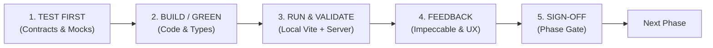
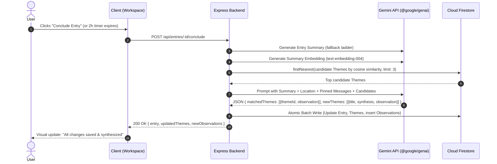

# Locus — Phased Implementation Plan & Engineering Playbook

*Design doc 3 of 3. Companions: `Locus — Core Object Model & Schema`, `Locus — Integrations, Demo Tooling & Build Plan`, `DESIGN.md`, `PRODUCT.md`.*

---

## 🔁 The Phase Execution Lifecycle: Contract-Driven & Mock-Boundary TDD

Every phase in this implementation plan operates under a non-negotiable **5-Step Test-Driven Development (TDD) Cycle**:



### The 3-Tier Locus TDD Pyramid

Because live LLMs are non-deterministic and external networks burn quota, testing adheres to 3 distinct strata:

1. **Tier 1: Fast Unit TDD (sub-100ms, Pure Functions)**:
   - Written *before* implementation code. Covers PII regex scrubbing, recursive `stripUndefined` hygiene, 2-hour inactivity delta math, prompt formatting templates, and LLM JSON output schema parsing.
2. **Tier 2: Service & Pipeline Mock-Boundary TDD (Mocks & Fallbacks)**:
   - Written alongside service wrappers. Simulates external failure modes: Gemini 429 rate limits, 503 service outages, model fallback ladder progression, malformed JSON recovery, and SSRF rejection of private IP ranges (`127.0.0.1`, `169.254.169.254`).
3. **Tier 3: Playwright E2E & Route TDD (Full-Stack Lifecycle & Visual Proof)**:
   - Written to validate user journeys and HTTP route contracts (`/api/entries/:id/conclude`, message pinning, auto-conclude timers), responsive viewport stability, and Impeccable visual rules (Source Serif 4 typography, Rule of One Accent `#3B7A57`).

### 5-Step Phase Sequence:
1. **`[TEST FIRST]`**: Author failing unit specs or Playwright route contracts (`tests/unit/`, `tests/e2e/`) specifying inputs, schema validations, and simulated error boundaries before writing service logic.
2. **`[BUILD / GREEN]`**: Write minimal types, services, integration clients, or React components to make tests pass cleanly, adhering strictly to [Locus Software Standards](file:///c:/Users/reyna/OneDrive/Documents/Locus/.agents/rules/software-standards.md) and [DESIGN.md](file:///c:/Users/reyna/OneDrive/Documents/Locus/DESIGN.md).
3. **`[RUN & VALIDATE]`**: Boot the unified server (`npm run dev`) and execute test runners (`npm run test:unit`, `npm run test:e2e`).
4. **`[FEEDBACK]`**: Run Impeccable design audits (`$impeccable audit / critique / polish`), capture visual screenshot proof, and prompt the user for interactive alignment.
5. **`[SIGN-OFF]`**: Confirm the phase's verification gate criteria (0 test failures, 0 lint errors, 0 design drift) before advancing.

---

## 📋 Phase 0: Architectural Triage, Re-evaluation & Verification Harness

### Objective
Re-evaluate the inherited Google AI Studio prototype, separate durable infrastructure from legacy clutter, align the repository to the [Locus Core Object Model](file:///c:/Users/reyna/OneDrive/Documents/Locus/docs/Locus-Core-Object-Model.md), and establish automated Playwright testing.

### Codebase Triage Matrix

| Component / File | Current Status | Action | Rationale |
|---|---|---|---|
| **Firebase Auth** (`src/lib/firebase.ts`) | Working Google popup auth | **KEEP** | Complies with federated authentication standard. Keep user session listener intact. |
| **Server Deserialization** (`server.ts`) | Top-level body parsers mounted first | **KEEP** | Complies with Software Standard 6.1 (ordering guarantee). |
| **Model Fallback Ladder** (`server.ts`) | `MODEL_FALLBACK_LADDER` helper exists | **KEEP & REFACTOR** | Move helper into reusable service module (`src/services/gemini.ts`). |
| **Undefined Stripping** (`src/lib/firebase.ts`) | Basic `stripUndefined` utility | **KEEP & EXPAND** | Ensure recursive stripping handles nested arrays and null objects safely. |
| **Data Types** (`src/types.ts`) | Uses legacy `Interaction` & `NotebookItem` | **REWORK** | Replace with locked schema: `Entry`, `Message`, `Theme`, `ThemeObservation`. Move `NotebookItem` to deferred status. |
| **Firestore Collections** (`src/lib/firebase.ts`) | `/users/{uid}/interactions` | **REWORK** | Migrate collection paths to `/users/{uid}/entries`, `/users/{uid}/themes`, `/users/{uid}/observations`. |
| **Firestore Rules** (`firestore.rules`) | Basic owner check on `interactions` | **REWORK** | Add owner-bound rules for `entries`, `themes`, `observations` guaranteeing strict user isolation. |
| **Sidebar & Pill Controls** (`src/components/`) | 11 permanent pills & dual taxonomies | **REBUILD** | Replace with Impeccable calm wireframes: collapsed toolbar, single taxonomy, serif user voice. |
| **Synthesis Pipeline** (`src/components/IntelligenceDrawer.tsx`) | Client-side ad-hoc prompt | **REBUILD** | Replace with backend synchronous synthesis pipeline (`embed ➔ findNearest ➔ Gemini resolution ➔ batch write`). |
| **Integrations** (PII, Webhooks, Maps) | Missing / stubs | **REBUILD** | Implement isolated wrappers in `src/integrations/<service>/` per third-party integration standards. |

### Technical Implementation Details
1. **Verification Tooling Setup**:
   - Install Playwright: `npm install -D @playwright/test`.
   - Scaffold `playwright.config.ts` targeting `http://localhost:3000` with headless Chromium.
   - Create test harness directory: `tests/e2e/`.
2. **Schema Restructuring** (`src/types.ts`):
   ```typescript
   export type EntryStatus = 'active' | 'concluded';
   
   export interface EntryLocation {
     name: string;            // e.g. "Balanga, Bataan", "Home Office", or "The Mill Coffee, SF"
     latitude?: number;       // Optional GPS lat
     longitude?: number;      // Optional GPS lng
     source: 'gps' | 'manual';
   }

   export interface Entry {
     id: string;
     userId: string;
     createdAt: string;
     concludedAt?: string;
     status: EntryStatus;
     summary?: string;
     locationContext?: EntryLocation | null;
     mood?: string;
     stance?: string;
     isDemo?: boolean;
   }

   export interface Message {
     id: string;
     entryId: string;
     userId: string;
     role: 'user' | 'ai';
     content: string;
     timestamp: string;
     isPinned?: boolean;
     note?: string;
   }

   export interface Theme {
     id: string;
     userId: string;
     title: string;
     currentSynthesis: string; // rolling 2-3 sentences
     observationCount: number;
     createdAt: string;
     updatedAt: string;
     embedding?: number[];
     isDemo?: boolean;
   }

   export interface ThemeObservation {
     id: string;
     userId: string;
     entryId: string;
     themeId: string;
     observationText: string;
     timestamp: string;
     locationSnapshot?: string; // e.g. "Home Office" at time of observation
     isDemo?: boolean;
   }
   ```
3. **Firestore Security Rules Realignment** (`firestore.rules`):
   - Enforce absolute user document isolation:
     `match /users/{userId}/{document=**} { allow read, write: if request.auth != null && request.auth.uid == userId; }`

### User Actions & External Services Required
- [ ] Confirm local `.env` contains `VITE_FIREBASE_API_KEY`, `VITE_FIREBASE_PROJECT_ID`, and `GEMINI_API_KEY`.

### Verification Gate (Phase 0)
- `npm run lint` (`tsc --noEmit`) passes cleanly with new schema.
- Playwright runner boots and passes a basic smoke test (`npx playwright test`).

---

## ⚡ Phase 1: Core Loop & Synchronous Synthesis Pipeline

### Objective
Build the immutable `Entry` lifecycle (`Start Entry` ➔ `Send Message` ➔ `Conclude Entry`), turn pinning/notes, the 2-hour inactivity auto-conclude timer, and the synchronous Gemini + Vector similarity synthesis pipeline.

### Technical Implementation Details



1. **2-Hour Auto-Conclude Engine**:
   - Client records `lastActivityTimestamp` in `localStorage`.
   - On tick (every 30s), if `Date.now() - lastActivity > 2 * 60 * 60 * 1000`, automatically dispatch conclusion.
   - Server-side defense: Backend validates inactivity delta on entry fetch; if past 2 hours and still `active`, triggers conclusion on server.
2. **Synchronous Synthesis Pipeline (`src/services/synthesis.ts`)**:
   - **Step 1: Summary Generation**: Summarizes conversation transcript via `generateContentWithFallback()`.
   - **Step 2: Vector Embedding**: Embeds summary into 768-dimensional vector using `@google/genai`.
   - **Step 3: Vector Similarity Search**:
     Queries Firestore collection `/users/{userId}/themes` using `findNearest('embedding', queryVector, { limit: 3, distanceMeasure: 'COSINE' })`.
   - **Step 4: LLM Resolution**:
     Prompts Gemini with: Entry summary, location context (e.g. "Reflected from Coffee Shop"), candidate Theme titles + current syntheses, and any **pinned messages + user notes** (injected as high-priority semantic anchors). The model outputs structured JSON resolving observations to existing themes or creating new ones.
   - **Step 5: Transactional Persistence**:
     Executes atomic batch write to Firestore: updates Entry `status: 'concluded'`, creates new `ThemeObservation` records, and updates Theme `currentSynthesis`.
3. **Message Pinning & Notes**:
   - `PATCH /api/entries/:entryId/messages/:messageId` toggles `isPinned: boolean` and updates `note: string`.

### User Actions & External Services Required
- [ ] **Google Cloud Console**: Ensure Cloud Firestore is in Native mode.
- [ ] **Firestore Composite Vector Index**: Run index creation command:
  ```bash
  gcloud firestore indexes composite create \
    --collection-group=themes \
    --query-scope=COLLECTION \
    --field-config=vector-config='{"dimension":"768","flat":{}}',field-path=embedding
  ```
  *(Or configure via Firebase Console: Indexes ➔ Composite ➔ Vector Index).*

### TDD Test-First Specifications & Verification Plan

#### 1. Tier 1: Unit TDD (Written First)
- **Auto-Conclude Timer Math (`tests/unit/auto-conclude.spec.ts`)**:
  - Assert that an entry updated 119m ago evaluates to `isActive: true`.
  - Assert that an entry updated 121m ago evaluates to `isActive: false` (triggers conclude payload).
- **Prompt & JSON Contract Formatter (`tests/unit/synthesis-prompt.spec.ts`)**:
  - Assert that Entry turns and pinned messages format into deterministic prompt blocks with `<<<USER_INPUT>>>` delimiters.
  - Assert that LLM responses with wrapped markdown (````json ... ````) parse into valid `Theme` and `ThemeObservation` objects.

#### 2. Tier 2: Service Mock-Boundary TDD
- **Gemini Fallback & Synthesis Service (`tests/unit/gemini-fallback.spec.ts`)**:
  - Mock Gemini client throwing simulated 429 quota exhaustion; assert that `generateContentWithFallback()` sequentially attempts the next model on the ladder (`gemini-3.1-flash-lite`).
  - Mock vector search cosine similarity returning candidate theme matches; assert LLM resolution prompt receives candidates properly.

#### 3. Tier 3: Playwright E2E & Route TDD (`tests/e2e/core-loop.spec.ts`)
- Script dialogue across 4 turns.
- Test message pinning and inline note persistence via `PATCH /api/entries/:id/messages/:messageId`.
- Trigger `/api/entries/:id/conclude` and assert HTTP 200 with structured JSON response.
- Assert Firestore persistence: Entry `status: 'concluded'`, Theme exists with rolling synthesis, Observation contains `entryId` backlink.

#### 4. Manual Walkthrough
- Run 3 distinct conversations: (1) Work burnout, (2) Creative project, (3) Work burnout follow-up.
- Verify conversation (3) appends a second observation to the existing Work Theme rather than creating a duplicate.
- Fast-forward the local 2-hour inactivity timer (set threshold to 30 seconds) and confirm auto-conclude executes cleanly.

### Impeccable Design & Feedback Checkpoint
- Run `$impeccable shape session-workspace` to verify calm, distraction-free chat stream and invisible auto-conclude countdown.
- Request user review on synthesis prompt accuracy and Theme clustering fidelity.

---

## 🔒 Phase 2: Integration Layer (Strict Fallback Ladder)

### Objective
Implement the four core integrations in strict risk/priority order:
$$\text{PII Sanitizer} \longrightarrow \text{Unpack Further} \longrightarrow \text{Notification Dispatcher} \longrightarrow \text{Dual-Mode Geocoding}$$
If build time runs short, features are dropped from the bottom up (Geocoding cut first, Sanitizer preserved at all costs).

### Integration Technical Specifications

```
src/integrations/
├── sanitizer/                   # Integration 1: Outbound PII Scrubber
│   ├── client.ts
│   ├── regex.ts
│   ├── types.ts
│   └── __tests__/fixtures.test.ts
├── unpack/                      # Integration 2: Theme Writing Engine
│   ├── client.ts
│   ├── prompt.ts
│   └── types.ts
├── notifications/               # Integration 3: SSRF-Hardened Webhooks + Email
│   ├── webhook.ts               # SSRF DNS IP validator
│   ├── email.ts                 # Resend / SendGrid client
│   ├── types.ts
│   └── __tests__/ssrf.test.ts
└── geocoding/                   # Integration 4: Dual-Mode Location Context
    ├── client.ts
    ├── types.ts
    └── __tests__/location.test.ts
```

#### 1. Outbound PII Sanitizer (`src/integrations/sanitizer/`)
- **Scope**: Outbound only. Raw reflections in Firestore stay unredacted for the user.
- **Function**: `sanitizeForOutbound(text: string): string`.
- **Regex Coverage**: Phone numbers (North American & E.164 formats), email addresses, exact street addresses.
- **Egress Gates**: Injected as middleware before: (a) Gemini synthesis calls, (b) embedding generation, (c) webhook payloads, (d) transactional emails.

#### 2. Unpack Further Engine (`src/integrations/unpack/`)
- **Condition**: Available on Themes with $\ge 2$ Observations.
- **Mechanism**: Pure prompt engineering against Gemini (zero external API risk).
- **Prompt**: Takes Theme title, rolling synthesis, and chronological Observation deltas ➔ returns a working title, one-line evolutionary thesis, and structured writing outline.

#### 3. Notification Dispatcher (`src/integrations/notifications/`)
- **Webhook Path (Zapier / Make)**:
  - High-risk SSRF vector. Enforces dual validation (at save time AND at send time):
    1. Scheme check: `https://` only.
    2. DNS IP Resolution: Resolves hostname to IP and blocks all private/reserved CIDRs: `10.0.0.0/8`, `172.16.0.0/12`, `192.168.0.0/16`, `127.0.0.0/8`, `169.254.0.0/16` (Cloud Metadata endpoint), and IPv6 equivalents.
    3. Redirect check: Transparent redirects forbidden.
    4. Timeout & Backoff: 3-second hard timeout, single retry with exponential backoff. Fire-and-forget; never blocks Entry conclusion.
    5. Rate Limiting: Max 5 outbound webhooks per user per hour.
- **Email Path**:
  - Dispatches conclusion executive summary via Resend / SendGrid API. User content HTML-escaped to prevent injection.

#### 4. Dual-Mode Location Context (`src/integrations/geocoding/`)
- **Dual Mode**:
  - **Mode A (GPS Auto-Detect)**: Browser requests `navigator.geolocation`, sends coordinates to backend, backend resolves city/district string via Google Maps Geocoding API, then **immediately discards raw coordinates**.
  - **Mode B (Manual Place Name)**: User clicks location pill and types a place name (e.g. `"Home Office"`, `"Kyoto, Japan"`, `"Coffee Shop"`). Works seamlessly when GPS is disabled or denied.
- **Theme Synthesis Enriched**: Location name passed into Gemini sessions allows the AI to extract spatial and environmental patterns across reflections (e.g., creative breakthrough outdoors vs. burnout at the desk).

### User Actions & External Services Required
- [ ] **Google Cloud Console**: Enable **Geocoding API** and generate an API key restricted to Geocoding API (`GOOGLE_MAPS_API_KEY`).
- [ ] **Transactional Email**: Obtain API key from [Resend](https://resend.com) or SendGrid (`EMAIL_API_KEY`).
- [ ] **Zapier Webhook**: Setup a catch-hook URL in Zapier/Make for end-to-end webhook verification.

### Testing & Verification Plan
- **Sanitizer Fixture Test (`tests/unit/sanitizer.test.ts`)**:
  - Run test suite with 15 known PII strings and 10 near-PII non-sensitive strings. Assert PII is redacted while surrounding journal sentiment remains intact.
- **SSRF Hardening Test (`tests/unit/ssrf.test.ts`)**:
  - Test targets: `http://localhost:3000`, `http://127.0.0.1:8080`, `http://169.254.169.254/latest/meta-data`, and `http://10.0.0.1`.
  - Assert all are strictly rejected with `400 Invalid Webhook Destination`.
- **Location Context Test (`tests/unit/geocoding.test.ts`)**:
  - Test GPS resolution mock and manual place input. Assert only clean `name` is stored on Entry without raw coordinates leaking.

### Impeccable Design & Feedback Checkpoint
- Verify location input pill is compact, quiet, and non-intrusive.
- Review webhook test payloads with user to confirm zero raw user data leakage.

---

## 🎨 Phase 3: Screen Development & Impeccable Craft Execution

### Objective
Implement the complete UI/UX architecture defined in [DESIGN.md](file:///c:/Users/reyna/OneDrive/Documents/Locus/DESIGN.md) and [PRODUCT.md](file:///c:/Users/reyna/OneDrive/Documents/Locus/PRODUCT.md) using React 19, TailwindCSS v4, Lucide React, and Framer Motion.

### Screen Wireframe Breakdown

```
Screen 1: Reflections Home (/)
┌────────────────────────────────────────────────────────┐
│  [Logo] Locus     [Search]     Reflections  Themes  (Avatar) │
├────────────────────────────────────────────────────────┤
│  [Banner] Theme ready to unpack: Creative Crossroads  │
│  "3 observations synthesized over 2 weeks" [Unpack] [x]│
├────────────────────────────────────────────────────────┤
│  ▼ Ready for Synthesis (2 themes ready)               │
├────────────────────────────────────────────────────────┤
│  Past Reflections                       [+ Start Entry]│
│  ┌──────────────┐  ┌──────────────┐  ┌──────────────┐  │
│  │ Overwhelm    │  │ Architecture │  │ Morning Walk │  │
│  │ Sep 3 · 4m   │  │ Sep 1 · 8m   │  │ Aug 28 · 2m  │  │
│  │ [Focused]    │  │ [Mindful]    │  │ [Reflect]    │  │
│  └──────────────┘  └──────────────┘  └──────────────┘  │
└────────────────────────────────────────────────────────┘

Screen 2: Active Workspace (/entry/:id)
┌────────────────────────────────────────────────────────┐
│  ← Back    Career Crossroads    [Loc: Office] Auto: 1h45m│
├────────────────────────────────────────────────────────┤
│  User: I feel like the engineering roadmap is slipping.│
│                                                        │
│  AI: What specific friction surfaced first this week? │
│     [Hover: 📌 Pin  📝 Note  📋 Copy]                 │
├────────────────────────────────────────────────────────┤
│  Mood: Focused · Stance: Mindful Unpack ▾              │
│  ┌──────────────────────────────────────────────────┐  │
│  │ Type your reflection...           [Cmd+Enter] [Send]│
│  └──────────────────────────────────────────────────┘  │
└────────────────────────────────────────────────────────┘

Screen 3: Themes Master-Detail & Graph (/themes)
┌────────────────────────────────────────────────────────┐
│  Themes                         [ Timeline | Graph ]   │
├─────────────────────────┬──────────────────────────────┤
│  [Search Themes...]     │ Creative Crossroads          │
│  ┌────────────────────┐ │ Current Synthesis:           │
│  │ Creative Cross...  │ │ "Transitioning from tools to │
│  │ 4 observations     │ │  focusing on execution..."   │
│  ├────────────────────┤ │ [Unpack Further]             │
│  │ Team Delegation    │ ├──────────────────────────────┤
│  │ 2 observations     │ │ Observation Timeline:        │
│  └────────────────────┘ │ • Sep 4: Realized perfection │
│                         │   was stalling the release.  │
│                         │   (Re: Overwhelm →)          │
└─────────────────────────┴──────────────────────────────┘
```

### Technical Implementation Details
1. **Screen 1: Reflections Home (`src/components/ReflectionsHome.tsx`)**:
   - **Mobile-First Architecture**:
     - Designed from the ground up for phone viewports ($< 768\text{px}$) using touch-optimized targets ($\ge 44\text{px}$), single-thumb navigation, and progressive enhancement scaling to wide desktop screens.
   - **Daily Journaling Prompt Banner**:
     - A dismissible, tranquil banner prominently positioned at the top of the feed with an inspiring daily contemplation (e.g., *"What is one decision you are avoiding because you already know the answer?"*).
     - Clicking the banner automatically initiates a New Reflection, carrying the daily prompt as a floating inspiration chip above the writing area that gently dissolves as soon as the user writes their first reflection turn.
   - **Hero Strip**: Dismissible card highlighting latest ready Theme (`observationCount >= 2`).
   - **Collapsible "Ready for Synthesis" section**: Horizontal scrolling ribbon.
   - **Google Keep-Style 2-Column Masonry Card Grid**:
     - **Layout**: 2-column vertical masonry grid on mobile (`columns-2 gap-3 space-y-3`), scaling to 3 columns on tablet and 4 columns on large desktop (`md:columns-3 lg:columns-4 gap-4 space-y-4`).
     - **Card Anatomy (Smart Minimalist Keep Note)**:
       - **Title**: Source Serif 4 (`font-serif text-sm font-semibold text-primary tracking-tight leading-snug`).
       - **Metadata**: Subtle location pill (`📍 Coffee Shop, Balanga`) and relative date hint (`Yesterday`, `2h ago`).
       - **Conversation Gist**: 3–4 sentence synthesized AI summary in readable Inter (`text-xs text-[#4A4A4A] leading-relaxed line-clamp-6`). Gives the user immediate cognitive recall at a glance without having to open the chat.
       - **Qualitative Tags**: Minimalist chips (`#Breakthrough`, `#Decision`, `#Friction`, `#Reflective`) in soft `#F4F3EE` tint.
     - **Interaction**: Tapping any card opens/unfolds the full multi-turn conversational transcript in `SessionWorkspace`.
     - **Action**: Single accent `#3B7A57` `+ Start Reflection` floating/header action.
2. **Screen 2: Active Workspace (`src/components/SessionWorkspace.tsx`)**:
   - Source Serif 4 user bubbles (`#F2EFEB`), Inter AI bubbles (`#FFFFFF`).
   - Message-level inline hover toolbar: Pin toggle (`isPinned`), Note popover, and Copy.
   - Dual-mode location pill (`[ 📍 Home Office ]`) with quick-edit popover.
   - Collapsed toolbar (`Mood: Focused · Stance: Mindful Unpack ▾`).
   - Auto-conclude timer hint and prominent `Conclude Entry` button.
3. **Screen 3: Themes Split & Graph (`src/components/ThemesView.tsx`)**:
   - Segmented toggle: `[ Timeline ]` vs `[ Concept Graph ]`.
   - **Mode A (Split Master-Detail)**: Left rail (35%) list of Themes; right canvas (65%) with rolling synthesis, `Unpack Further` CTA, and chronological Observation feed with entry backlinks.
   - **Mode B (Concept Graph)**: Force-directed SVG/Canvas graph. Theme nodes dynamically sized by `observationCount`. Clicking a node zooms in and animates satellite Observation nodes into view.
4. **Screen 4: Settings Drawer (`src/components/SettingsDrawer.tsx`)**:
   - Left tabs:
     - **Persona & Tone**: Presets (Warm, Direct, Reflective, Mindful) + Custom Instructions textarea.
     - **Integrations**: Zapier incoming webhook URL input (with inline SSRF validation feedback) and Email dispatch preferences.
     - **Demo Mode**: One-click "Enter Demo Mode" / "Exit Demo Mode" sandbox toggle.

### Active Impeccable Workflow
- Run `$impeccable shape reflections-home` before finalizing layout.
- Run `$impeccable audit` on all 4 screens to guarantee WCAG AA contrast against `#FAF9F6` and zero mobile overflow.
- Run `$impeccable polish` to verify font division (Serif for user prose, Sans for UI) and complete anti-leakage of vendor terms.

### Testing & Verification Plan
- **Playwright E2E Test (`tests/e2e/screens.spec.ts`)**:
  - Full happy path: Open Home ➔ Click `+ Start Entry` ➔ Chat 3 turns ➔ Pin turn 2 ➔ Conclude ➔ Land on Themes ➔ Switch to Graph View ➔ Zoom node ➔ Open Settings.
- **Visual Capture**: Playwright captures full-page screenshot artifacts of all 4 screens for review.

### Impeccable Design & Feedback Checkpoint
- Present screenshots to user. Verify that single accent `#3B7A57` is strictly enforced and that no competing pills exist.

---

## 🏛️ Phase 3.6: Centered Sanctuary Portal (`LandingPage.tsx`) & Full-App Impeccable UX Finalization

### Objective
Eliminate the generic, AI-generated marketing landing page and replace it with an authentic, centered, rounded rectangular sanctuary portal ($1080 \times 640\text{px}$, 70/30 split), add Email Authentication in `src/lib/firebase.ts`, and run comprehensive Impeccable UX polish passes across all views before building the guided tour.

### Architectural Breakdown

```
Centered Sanctuary Portal Card (Desktop 1080px × 640px)
┌───────────────────────────────────────────────────┬──────────────────────────────┐
│  LEFT ~70%: Auto-Rotating Visual Showcase         │  RIGHT ~30%: Auth & Sandbox  │
│  ┌─────────────────────────────────────────────┐  │  [Logo] Locus / ReflectAI    │
│  │                                             │  │  "A private sanctuary for    │
│  │  [Slide 1 / 2 / 3 Showcase Viewport]        │  │   deep personal reflection"  │
│  │  • Card 1: Longitudinal Thought Trajectory  │  │                              │
│  │  • Card 2: Concept Graph & Spiral Bloom     │  │  [ G  Sign in with Google ]  │
│  │  • Card 3: Calm, Private Thinking           │  │                              │
│  │                                             │  │  [ ✉️  Sign in with Email  ]  │
│  │  [ ◯ ◯ ◯ ] Auto-progress indicator pills   │  │                              │
│  └─────────────────────────────────────────────┘  │  ───────── OR ─────────────  │
│  "Thoughts evolve into themes, not task lists"    │  [ 🚀 Try Demo Space ]       │
│                                                   │  (Loads 30d data + Tour)     │
└───────────────────────────────────────────────────┴──────────────────────────────┘
```

1. **The Centered Sanctuary Portal Card (`src/components/LandingPage.tsx`)** `[COMPLETED]`:
   - **Dimensions & Atmosphere**: Max-w-5xl, centered horizontally and vertically on `#FAF9F6` canvas with soft elevation shadow (`shadow-xl`), rounded corners (`rounded-3xl`), and hairline border (`border-border-hairline`).
   - **Left Panel (~68%) — Auto-Rotating Visual Showcase Carousel**:
     - Auto-rotating cards with 6-second cadence, pause-on-hover, and smooth cross-fade animation.
     - **Slide 1: Longitudinal Thought Trajectory**: Visual progression demonstrating how episodic daily reflections crystallize into persistent themes over weeks rather than fleeting task lists.
     - **Slide 2: Concept Graph & Spiral Bloom**: Interactive animated preview of theme nodes, connected observations, and directed vectors ($Obs_1 \rightarrow Obs_2 \dots$).
     - **Slide 3: Calm, Private Thinking**: Source Serif 4 prose, 2-hour auto-conclude assurance, zero streaks/gamification, and local/isolated encryption.
     - Subtle progress indicators (`3 pills`) with direct click navigation.
   - **Right Panel (~32%) — Focused Auth & Action Column**:
     - Locus wordmark & subtle mission statement.
     - **Sign in with Google** button (`#hero-google-signin-btn`).
     - **Sign in with Email** (clean toggleable email/password form for non-Google users with error handling).
     - **"Try Demo" CTA** (`#hero-demo-mode-btn`): Direct zero-friction gateway that loads the authentic 30-day simulation dataset, navigates to Reflections Home, and launches the Guided Walkthrough Tour.
   - **Responsive Stacking**: On mobile viewports ($< 768\text{px}$), the card stacks seamlessly: the showcase becomes a swipeable top banner, and the auth actions sit thumb-friendly below it.

2. **Email Authentication Support (`src/lib/firebase.ts`)** `[COMPLETED]`:
   - Implement `signInWithEmail(email, password)` and `signUpWithEmail(email, password)` using Firebase Auth `signInWithEmailAndPassword` and `createUserWithEmailAndPassword`.

3. **Full-App Impeccable UX Polish Passes** `[COMPLETED]`:
   - **Pass 1 — Anti-AI Design Purification**:
     - Bespoke `LocusMark` monogram (`⊙`) replacing Lucide `Sparkles` brand logo.
     - Whole-word semantic title distillation (`extractCleanTitle()`) with punctuation-aware sentence breaks, avoiding severed syllables.
     - Universal prose markdown header and syntax stripping (`cleanProseSnippet()`) across card previews.
     - Quiet Source Serif 4 thought indicator (*"Reflecting with you…"*) replacing ChatGPT-style bouncing gray skeleton bars.
   - **Pass 2 — Adaptive Grid Density & Calibrated Stillness**:
     - Count-adaptive layout in `ReflectionsHome.tsx` eliminating 65% dead white space on 1–2 cards (`max-w-xl mx-auto` for 1, `max-w-4xl grid-cols-2` for 2, responsive `grid-cols-3/4` for $\ge 3$).
     - 100% elimination of residual `Sparkles` icons (0 occurrences in entire codebase).
     - Eradication of anxious `animate-pulse` loops in favor of calm steady sage rings.
     - App-level loading monogram using static `LocusMark`.

4. **Testing & Verification (Phase 3.6 Gate)** `[VERIFIED]`:
   - `npm run lint` (`tsc --noEmit`): 0 errors.
   - `node .agents/skills/impeccable/scripts/detect.mjs src/`: 0 anti-patterns.
   - `npm run test:unit`: 68/68 passed.
   - `npx playwright test tests/e2e/smoke.spec.ts`: 1/1 passed.
   - `npx playwright test tests/e2e/screens.spec.ts`: 4/4 passed.

---

## 🏛️ Phase 3.7: Locus Strata Architecture (Hybrid Model, Sealed Reader, Marginalia & The Return) `[COMPLETED & VERIFIED]`

### Objective
Incorporate the comprehensive "Strata" architectural refactor into the core product, transitioning Locus from a purely conversational tool into an archival journal where active sessions are intimate conversational sanctuaries and concluded entries become permanently sealed, immutable records annotated through marginalia stamped with temporal distance.

### The Four Architectural Strata Pillars:
1. **The Active Sanctuary (Conversational Companion)**:
   - Real-time, multi-turn reflective dialogue across 4 stances (`Reflective Mirror`, `Idea Spark`, `Action Blueprint`, `Mindful Unpack`).
   - Renamed ephemeral "Pin" to permanent **"Bookmark"** (`isBookmarked: boolean`) with dedicated ribbon icon and analytical notes.
   - Dedicated [`BookmarksDrawer.tsx`](file:///c:/Users/reyna/OneDrive/Documents/Locus/src/components/BookmarksDrawer.tsx) supporting Chronological and Grouped-by-Reflection views, search, quote copying, and direct entry jump.
   - Offline IndexedDB sync buffer (`src/lib/offlineSync.ts`) with `beforeunload` warning and inline resend affordance on failure.
2. **The Strata Layer (Marginalia & Immutability)**:
   - Concluded entries become strictly immutable with cryptographic hash and `bodySealedAt` proof.
   - 2-column desktop reader ([`EntryReaderWithStrata.tsx`](file:///c:/Users/reyna/OneDrive/Documents/Locus/src/components/EntryReaderWithStrata.tsx)) featuring a $34\text{rem}$ centered reading column and an $18\text{rem}$ recessed margin gutter.
   - Margin notes (`Stratum`) stamped with Courier Prime temporal distance (`written 94 days later`) and 5 semantic ink stances (`correction`, `confirmation`, `question`, `grief`, `gratitude`).
   - **Silent AI Margin Policy**: The AI remains 100% silent in the margin column; margin notes are vector-embedded to update Theme observations without conversational intrusion.
3. **The Return (Daily Archivist Loop)**:
   - A dedicated daily surface ([`TheReturnView.tsx`](file:///c:/Users/reyna/OneDrive/Documents/Locus/src/components/TheReturnView.tsx)) presenting **one past entry** selected by explainable heuristics (`anniversary`, `unresolved`, `contradiction`, `dormant`) via [`returnRouter.ts`](file:///c:/Users/reyna/OneDrive/Documents/Locus/src/services/returnRouter.ts).
   - Zero AI commentary; simply presents the past reflection, relevant strata, contradiction comparison banner if applicable, and an invitation: `[ Write in the margin ]`.
4. **Archival Dignity & Tactile Keep Cards**:
   - Retains the tactile Google Keep masonry cards on [`ReflectionsHome.tsx`](file:///c:/Users/reyna/OneDrive/Documents/Locus/src/components/ReflectionsHome.tsx) with count badges (`3 strata · +94d`), bookmark ribbons, and The Return banner.
   - Archival typography system (`Literata`, `Courier Prime`, `Archivo`, `Roboto`, `Overpass Mono`) and 5 substrate accent inks (`sage`, `moss`, `irongall`, `ochre`, `terracotta`).
   - Sensory & motion accessibility toggle (`reducedMotion`) adhering to WCAG 2.1 AA vestibular standards.
   - Zero Fake-AI: Elimination of synthetic fallback strings in [`synthesis.ts`](file:///c:/Users/reyna/OneDrive/Documents/Locus/src/services/synthesis.ts) in favor of honest error recovery.

### Verification Gate (Phase 3.7) `[PASSED]`:
- `npm run lint` (`tsc --noEmit`): **0 errors**.
- `npm run test:unit`: **93/93 unit tests passed** (including `strata-delta.test.ts`, `return-router.test.ts`, `no-fake-ai.test.ts`).
- `npm run test:e2e`: **22/22 Playwright tests passed** (including `strata-margins.spec.ts`, `the-return.spec.ts`, `screens.spec.ts`, `core-loop.spec.ts`).
- Production build: `npm run build` bundled successfully.
- Detailed report published: [`docs/DEVELOPMENT_REVIEW_REPORT.md`](file:///c:/Users/reyna/OneDrive/Documents/Locus/docs/DEVELOPMENT_REVIEW_REPORT.md).
- Prompts audited: [`docs/INTERNAL_PROMPTS_AUDIT.md`](file:///c:/Users/reyna/OneDrive/Documents/Locus/docs/INTERNAL_PROMPTS_AUDIT.md).

---

## 🛠️ Phase 4: Interactive Guided Walkthrough, Demo Dataset Realism & Final Polish `[IN PROGRESS]`

### Objective
Complete the interactive Guided Walkthrough Tour driving across the application as an authentic story from the user's perspective, pre-populate the 30-day simulation dataset with bookmarks and strata margins, expand email notification scheduling in Settings, and execute end-to-end user journey verification.

### Technical Implementation Details

#### 1. Interactive Guided Walkthrough Engine (`src/components/WalkthroughOverlay.tsx` & `src/App.tsx`)
Rather than an isolated static modal popup, the guided walkthrough operates as an **interactive, contextual floating controller** that actively drives the user across the live application:
- **Story Progression (8 Stages)**:
  1. **Stage 1 (Reflections Home)**: Introduces the canvas, explaining how thoughts are saved as tactile Google Keep cards. Prompts the user: *"Let's begin by writing a brief reflection."* Action: `[ Start Guided Reflection → ]` (opens fresh session).
  2. **Stage 2 (Active Workspace & Scripted Input)**: In `SessionWorkspace`, explains how the conversational companion assists without diagnosing. Provides sample prompt: `"I'm feeling good today"`. Action: `[ Send "I'm feeling good today" ]` (types into input, submits, and waits for AI response).
  3. **Stage 3 (Companion Insight & Bookmarking)**: Spotlights the Bookmark ribbon on the generated response. Explains: *"Meaningful epiphanies emerge during reflection. Bookmark them into your permanent ledger."* Action: `[ Bookmark Insight & Open Drawer → ]`.
  4. **Stage 4 (Bookmarks Drawer & Finite Pages)**: Opens `BookmarksDrawer`. Explains Chronological vs. Grouped-by-Reflection views. Explains the core philosophy: *"Like a real journal, entries in Locus have an end. You can conclude manually, or Locus will seal the entry for you after 2 hours. Once sealed, summaries and themes are synthesized."* Action: `[ Conclude & Seal Entry → ]`.
  5. **Stage 5 (Sealed Reader & Strata Margins)**: Navigates to `EntryReaderWithStrata`. Explains that the text is now permanently immutable (`bodySealedAt`). Highlights the $18\text{rem}$ margin gutter, Courier Prime temporal distance stamps (`written 94 days later`), and the 5 semantic ink stances. Action: `[ Meet The Return → ]`.
  6. **Stage 6 (The Return: Daily Archivist)**: Navigates to `TheReturnView`. Explains how Locus surfaces 1 past entry per day on anniversaries, unresolved threads, or contradictions—offering zero AI chatter and simply inviting the user to write in the margin. Action: `[ Explore Themes → ]`.
  7. **Stage 7 (Longitudinal Themes: Timeline)**: Navigates to `ThemesView`. Shows how episodic reflections crystallize into persistent themes over weeks. Explains the chronological Observation trajectory feed. Action: `[ Switch to Concept Graph → ]`.
  8. **Stage 8 (Concept Graph & Unpack Further)**: Toggles into the Concept Graph (spiral bloom constellation). Shows how clicking a theme reveals satellite observations, and demonstrates the `[ Unpack Further ]` button generating a thesis and structured outline. Action: `[ Complete Tour & Enter Sanctuary ]`.
- **First-Run Triggering & Dismissibility**:
  - Welcome Banner on `ReflectionsHome.tsx` for new users / demo space: *"New to Locus? Take the 2-minute reflective tour."*
  - Automatically offers the tour on first visit unless previously dismissed (tracked via `localStorage.getItem('locus_walkthrough_seen')`).
  - Non-blocking: Can be minimized, skipped, or re-launched anytime from Navbar or Settings.

#### 2. Authentic 30-Day Simulation Dataset Realism (`src/services/demoSimulator.ts` & `src/services/strataService.ts`)
Polish the seed data so the evaluator immediately experiences a lived-in, authentic archive:
- **Pre-seeded Bookmarks**: Tag key realizations on `demo-entry-1` (Paralysis Around Scope), `demo-entry-2` (Architectural Simplicity), and `demo-entry-4` with `isBookmarked: true` and reflective user notes.
- **Pre-seeded Strata Margins**:
  - `demo-entry-1`: Stratum 1 (+94d, stance: `correction`, *"Shipping the minimal core loop was the best decision we made. Tooling perfection was pure procrastination."*).
  - `demo-entry-1`: Stratum 2 (+120d, stance: `confirmation`, *"The core loop held up in production with 0 regressions."*).
  - `demo-entry-2`: Stratum 1 (+23d, stance: `gratitude`, *"Still grateful for eliminating the auxiliary microservices."*).
- **Unresolved Open Threads & Contradictions**:
  - Add explicit `openThreads` (e.g. *"Should we ship the web companion first or wait for native mobile?"*) and `bodySealedAt` on `demo-entry-1` to immediately trigger The Return's explainable `unresolved` evidence.

#### 3. Email Notification Cadence & Scheduling in Settings (`src/components/SettingsDrawer.tsx`)
Expand notification settings beyond a simple binary toggle:
- **Delivery Cadence**:
  - `Immediate on Conclusion`: Dispatches synthesis summary upon sealing an entry.
  - `Weekly Reflection Briefing`: Aggregates the week's key realizations and Theme updates into a Sunday/Monday briefing.
  - `Muted / Off`: Disables outbound email digests.
- **Schedule Customization**:
  - Day of the week dropdown (`Sunday`, `Monday`, `Friday`).
  - Delivery hour picker (e.g., 7:00 AM, 8:00 PM).

#### 4. Automated E2E Verification (`tests/e2e/interactive-walkthrough.spec.ts`)
- Scripted Playwright test running through all 8 stages of the interactive walkthrough:
  - Assert welcome banner triggers tour.
  - Assert navigation to workspace and typing of `"I'm feeling good today"`.
  - Assert companion response generates and bookmark spotlight appears.
  - Assert bookmark drawer opens and displays bookmarked turn.
  - Assert concluding entry transitions to Sealed Reader with margins.
  - Assert navigation to The Return and Themes view.
  - Assert Concept Graph toggle and Unpack Further button presence.
  - Assert completion returns cleanly to Reflections Home.

---

## 🚀 Phase 5: Production Readiness, Security Review & Final Git Delivery `[PENDING]`

### Objective
Finalize production bundling, complete documentation, execute clean git commit and push, and verify Cloud Run deployment readiness.

### Technical Implementation Details
1. **Production Bundling & Quality Gate**:
   - `npm run lint` (`tsc --noEmit`): 0 errors.
   - `npm run test:unit`: 100% passing.
   - `npm run test:e2e`: 100% passing.
   - `npm run build`: Production client (`dist/index.html`) and Express server (`dist/server.cjs`) bundled.
2. **Security & Threat Model Sign-off (5 Threat Zones)**:
   - Sanitizer scrubs outbound PII before LLM / webhook egress.
   - System instructions isolated from user transcript delimiters (`<<<USER_INPUT>>>`).
   - Webhook URLs protected by strict DNS IP resolution and SSRF blocking.
   - Firestore rules guarantee owner-bound user isolation (`request.auth.uid == userId`).
   - Zero hardcoded credentials or API keys in client SPA bundle or git history.
3. **Repository Delivery**:
   - Stage all modified and untracked files cleanly.
   - Author comprehensive commit: `feat: implement interactive guided walkthrough, demo dataset realism, settings cadence, and strata architecture`.
   - Push to `origin/main`.
