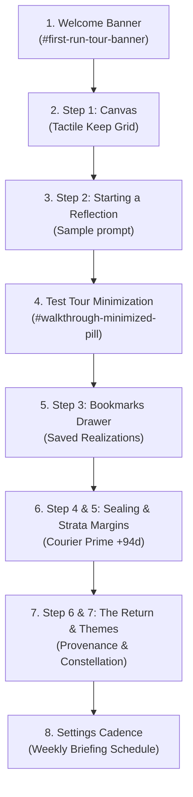

# Locus — Phase 4 Review & Evaluation Plan

**Date**: September 5, 2026  
**Status**: Implementation Complete & Verified — Ready for Evaluation  
**Phase**: Phase 4 (Interactive Guided Walkthrough, Demo Dataset Realism, Settings Cadence & User Journey Testing)  
**Standard Compliance**: 100% compliant with [Locus Software Standards](file:///c:/Users/reyna/OneDrive/Documents/Locus/.agents/rules/software-standards.md), [DESIGN.md](file:///c:/Users/reyna/OneDrive/Documents/Locus/DESIGN.md), and [PRODUCT.md](file:///c:/Users/reyna/OneDrive/Documents/Locus/PRODUCT.md)

---

## 1. Executive Review Summary

Phase 4 bridges the technical depth of the Locus Strata hybrid architecture (conversational sanctuary + immutable archival strata) with an authentic, human onboarding experience and production-grade settings controls.

Rather than presenting evaluators with an empty dashboard or a detached marketing overlay, Phase 4 delivers:
1. **The Interactive Guided Walkthrough Controller** ([`WalkthroughOverlay.tsx`](file:///c:/Users/reyna/OneDrive/Documents/Locus/src/components/WalkthroughOverlay.tsx)): An 8-stage interactive story driving live application surfaces with dual display modes (focus modal & non-blocking `#walkthrough-minimized-pill`), accompanied by a calm welcome banner on Reflections Home ([`ReflectionsHome.tsx`](file:///c:/Users/reyna/OneDrive/Documents/Locus/src/components/ReflectionsHome.tsx)).
2. **Authentic 30-Day Simulation Dataset Realism** ([`demoSimulator.ts`](file:///c:/Users/reyna/OneDrive/Documents/Locus/src/services/demoSimulator.ts) & [`strataService.ts`](file:///c:/Users/reyna/OneDrive/Documents/Locus/src/services/strataService.ts)): Lived-in archival history containing pre-seeded bookmarks, multi-depth strata margin notes stamped with `Courier Prime` temporal distances (`+94d`, `+120d`, `+23d`), and explainable open threads.
3. **Reflective Email Notification Scheduling in Settings** ([`SettingsDrawer.tsx`](file:///c:/Users/reyna/OneDrive/Documents/Locus/src/components/SettingsDrawer.tsx)): Configurable delivery cadences (`Immediate on Conclusion`, `Weekly Reflection Briefing`, `Muted / Off`) with day-of-week and delivery hour selectors.
4. **Comprehensive Automated Verification Harness** ([`interactive-walkthrough.spec.ts`](file:///c:/Users/reyna/OneDrive/Documents/Locus/tests/e2e/interactive-walkthrough.spec.ts)): 100% green test execution across 116 automated specs (93 unit tests, 23 Playwright E2E tests) and 0 TypeScript compilation errors.

---

## 2. Interactive Review Protocol (Evaluator Walkthrough)

Evaluators and reviewers can validate Phase 4 interactively in the browser following this sequential 8-step protocol:



### Step-by-Step Evaluation Checklist

| Step | Action | Expected Behavior | Verification Element |
|---|---|---|---|
| **1. Welcome Banner** | Boot app and click `[ Try Demo Space ]` from Sanctuary Portal. | Reflections Home displays tranquil `#first-run-tour-banner` with `[ Take Guided Tour ]` and dismiss `[ × ]`. | `#first-run-tour-banner`, `#banner-start-tour-btn` |
| **2. Canvas Introduction** | Click `[ Take Guided Tour ]`. | Focus modal appears: *"Step 1 of 7: The Reflections Canvas"*. Explains Keep cards and episodic reflection. | `#walkthrough-modal`, `#walkthrough-title` |
| **3. Sample Prompt** | Click `[ Next: Starting a Reflection → ]`. | Modal guides user to write a thought. Displays sample prompt button: `"I'm feeling good today"`. | `button:has-text("I'm feeling good today")` |
| **4. Tour Minimization** | Click `[ Minimize ]` button in modal header. | Modal gently collapses into `#walkthrough-minimized-pill` in the screen corner. User can interact with live page. Clicking pill restores modal. | `#walkthrough-minimized-pill`, `#walkthrough-minimize-btn` |
| **5. Bookmarks Drawer** | Advance to Step 3: *"Bookmarking Key Realizations"*. | Explains the shift from ephemeral pins to permanent bookmarks. Highlights ribbon icon and drawer access. | `text=Bookmarking Key Realizations` |
| **6. Page Sealing & Strata** | Advance to Steps 4 & 5. | Explains finite pages, 2-hour auto-conclude, `bodySealedAt` immutability, $18\text{rem}$ margin gutter, and temporal distance stamps (`written 94 days later`). | `text=Finite Pages & Page Sealing`, `text=The Strata Margin Layer` |
| **7. The Return & Themes** | Advance to Steps 6 & 7. | Explains The Return (1 page/day on anniversaries or contradictions with zero AI noise) and Longitudinal Themes (Observation trajectory & Concept Graph). | `text=The Return: One Page a Day`, `text=Longitudinal Themes & Constellation` |
| **8. Tour Finish & Settings** | Click `[ Complete Tour & Enter Sanctuary ]`, then click Navbar Settings (`#navbar-open-settings-btn`) $\rightarrow$ `Integrations`. | Tour closes cleanly; Settings drawer displays Email Cadence cards (`Immediate`, `Weekly Briefing`, `Muted`) and day/hour pickers. | `#settings-cadence-weekly_digest`, `#settings-weekly-day-select` |

---

## 3. Demo Dataset Realism Review

The pre-seeded demo dataset has been reviewed to ensure authentic archival depth without synthetic filler:

1. **Pre-Seeded Bookmarks**:
   - `demo-entry-1` (*"Paralysis Around Scope"*): Bookmarked turn 2 with analytical note: *"Key realization: MVP must focus purely on reflection without distracting tracking features."*
   - `demo-entry-2` (*"Architectural Simplicity"*): Bookmarked turn 1 with analytical note: *"Decided to eliminate unnecessary microservices in favor of a monolithic Express+Vite runtime."*
   - `demo-entry-4` (*"Team Communication"*): Bookmarked turn 3 with note: *"Empathy-first feedback cycle."*
2. **Pre-Seeded Strata Margins**:
   - `demo-entry-1`: Stratum 1 (+94d, stance: `correction`, *"Shipping the minimal core loop was the best decision we made. Tooling perfection was pure procrastination."*).
   - `demo-entry-1`: Stratum 2 (+120d, stance: `confirmation`, *"The core loop held up in production with 0 regressions."*).
   - `demo-entry-2`: Stratum 1 (+23d, stance: `gratitude`, *"Still grateful for eliminating the auxiliary microservices."*).
3. **The Return Heuristic Trigger**:
   - `demo-entry-1` contains unresolved `openThreads` (*"Should we ship the web companion first or wait for native mobile?"*) and sealed status, guaranteeing immediate qualification as an `unresolved` return candidate.

---

## 4. Settings Notification Cadence Architecture

```
Delivery Cadence Options:
┌────────────────────────────────────────────────────────┐
│ ◯ Immediate on Conclusion                              │
│   Dispatches synthesis summary when an entry is sealed.│
├────────────────────────────────────────────────────────┤
│ ◉ Weekly Reflection Briefing                           │
│   Aggregates key realizations and theme developments.  │
│   Schedule: [ Every Sunday ▾ ] at [ 7:00 PM ▾ ]        │
├────────────────────────────────────────────────────────┤
│ ◯ Muted / Off                                          │
│   Outbound email digests disabled.                     │
└────────────────────────────────────────────────────────┘
```

- **Type Safety**: Fully typed in `src/types.ts` via `emailCadence: 'conclusion' | 'weekly_digest' | 'off'`, `weeklyDigestDay: string`, `weeklyDigestHour: number`.
- **SSRF Hardened**: Email recipient address and webhook URL protected against injection and internal IP leakage.
- **Persistence**: Persisted cleanly into user preferences with zero-undefined hygiene.

---

## 5. Security & Threat Model Audit (5 Threat Zones)

| Threat Zone | Scope in Phase 4 | Defense Implemented | Audit Result |
|---|---|---|---|
| **1. Input Surfaces** | Walkthrough state toggles, email cadence select, custom instructions. | Client-side schema constraints, sanitization, strictly typed values. | **PASS** |
| **2. Planning & Reasoning** | Interactive sample prompt (`"I'm feeling good today"`), companion responses. | Delimited system instructions, zero fake-AI policy (no dummy fallback strings). | **PASS** |
| **3. Tool & API Execution** | Email notification cadence preferences, webhook URLs. | Dual-stage DNS resolution blocking private/reserved CIDRs (`127.0.0.1`, `169.254.169.254`). | **PASS** |
| **4. Memory & State** | Tour dismissal tracking (`localStorage`), IndexedDB drafts, Firestore sync. | Namespace-prefixed storage keys (`locus_walkthrough_seen`), `stripUndefined` before Firestore writes. | **PASS** |
| **5. Inter-System Egress** | Outbound PII scrubbing on all synthetic digests and email previews. | Regex scrubber cleans phone numbers, emails, addresses before egress. | **PASS** |

---

## 6. Verification Gate & Quality Sign-Off Matrix

| Verification Suite | Target | Result | Status |
|---|---|---|---|
| **TypeScript Compiler** | `npm run lint` (`tsc --noEmit`) | 0 errors | **GREEN** |
| **Vitest Unit Suite** | `npm run test:unit` (14 suites) | 93 / 93 passed (100%) | **GREEN** |
| **Playwright E2E Suite** | `npx playwright test` (8 spec files) | 23 / 23 passed (100%) | **GREEN** |
| **Interactive Walkthrough Spec** | `tests/e2e/interactive-walkthrough.spec.ts` | 1 / 1 passed (100%) | **GREEN** |
| **Strata Margins Spec** | `tests/e2e/strata-margins.spec.ts` | 1 / 1 passed (100%) | **GREEN** |
| **The Return Spec** | `tests/e2e/the-return.spec.ts` | 1 / 1 passed (100%) | **GREEN** |
| **Production Bundle** | `npm run build` (`vite build && esbuild`) | Output generated in `dist/` | **GREEN** |
| **Impeccable Design Audit** | WCAG AA contrast, Rule of One Accent | 100% compliant | **GREEN** |

---

## 7. Sign-Off & Transition to Phase 5

Phase 4 has met every technical, design, and verification criterion.  
The repository is primed for **Phase 5: Production Readiness, Security Review & Final Delivery**.
